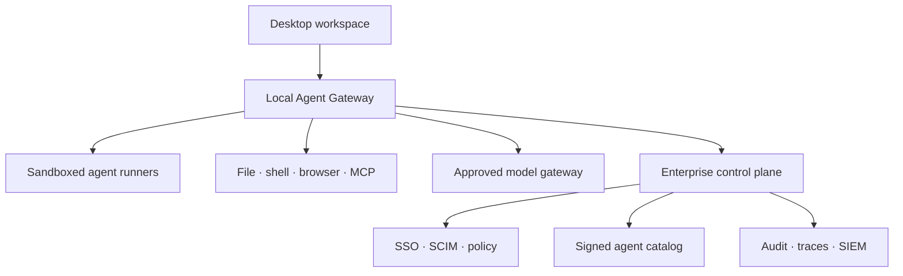
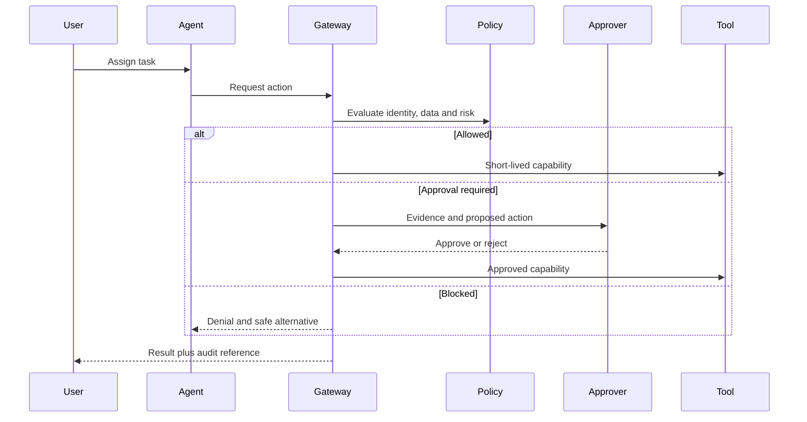

# AegisForge target architecture

## Product model

AegisForge should support three deployment modes from one codebase:

| Mode | Best for | Control and data posture |
| --- | --- | --- |
| Standalone | Individual or small trusted team | Local policy, local audit, direct provider/CLI use |
| Connected enterprise | Normal company deployment | Local execution plus central identity, policy, catalog and telemetry |
| Sovereign / air-gapped | Government, critical infrastructure, regulated data | Private models, registries and control plane; no public dependencies |

## Target topology

The gateway is the decisive component. The desktop cannot enforce enterprise
policy if a third-party CLI retains direct, ambient access to the host. Runners
should therefore execute in an OS sandbox, container or remote isolated worker,
and receive only gateway-issued capabilities.

## Core services

### Local Agent Gateway

- Normalizes agent events from CLI adapters and native SDK agents.
- Intercepts shell, file, network, browser, MCP and secret requests.
- Evaluates policy before action and creates an approval request when required.
- Issues narrow, expiring capability grants.
- Emits OpenTelemetry-compatible spans and structured audit events.
- Enforces time, token, spend and action budgets.

### Enterprise control plane

- Organization, tenant, team, workspace and environment hierarchy.
- OIDC/SAML sign-in, SCIM lifecycle and workload identity federation.
- Versioned policy-as-code with staged rollout and emergency rollback.
- Signed catalog for agents, skills, prompts, models and MCP servers.
- Approval inbox, evidence review and separation-of-duties rules.
- Fleet inventory, health and managed update rings.

### Execution runners

- Local OS sandbox for low-risk interactive work.
- Container or microVM for untrusted code and reproducible tasks.
- Kubernetes/OpenShift worker pools for enterprise queues.
- Egress proxy, read-only base image, ephemeral workspace and resource limits.
- Per-task identity; never a generic shared “agent service account.”

### Model and knowledge plane

- Routes to approved public or sovereign/local models.
- Applies data-residency, classification and retention policy.
- Tracks model/version, token use, cost, latency and fallback decisions.
- Provides RAG connectors with document ACL preservation and citation lineage.
- Runs evaluations before agents, prompts or models are promoted.

## Decision flow

## Delivery roadmap

### Phase 1 — governed local MVP

- Complete: separate product identity and packaging targets.
- Complete: policy profiles, launch preflight and tamper-evident local audit.
- Next: approval queue with one-time override tokens.
- Next: policy file schema, import/export and signed policy bundles.
- Next: cross-platform CI and native package smoke tests.

### Phase 2 — mediated execution

- Agent adapter protocol and local gateway daemon.
- Sandboxed runners with file/network capability grants.
- MCP proxy with tool-level allow/deny/approval policy.
- Secrets broker and redaction.
- OpenTelemetry traces and local evidence viewer.

### Phase 3 — enterprise control plane

- SSO/SCIM, organizations, RBAC/ABAC and separation of duties.
- Central policy distribution and signed extension/model catalogs.
- SIEM, vault, ticketing and CI/CD integrations.
- Cost, quota, evaluation and reliability dashboards.

### Phase 4 — sovereign platform

- OpenShift/Kubernetes deployment, private registries and offline bundles.
- Local model gateway for vLLM, llama.cpp and approved endpoints.
- Multi-region/data-residency controls and disaster recovery.
- Compliance evidence packs and framework mappings.

## Definition of “enterprise ready”

A task should be traceable from named human requester to named agent identity,
model/version, retrieved sources, each tool request, policy decision, approval,
side effect and final artifact. Revoking the task identity must immediately stop
new side effects without depending on the model to cooperate.
